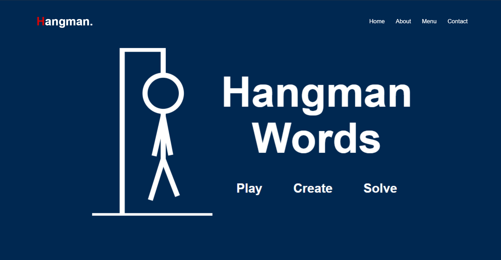
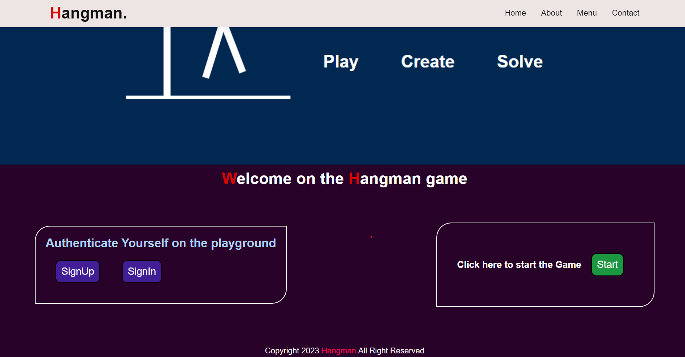
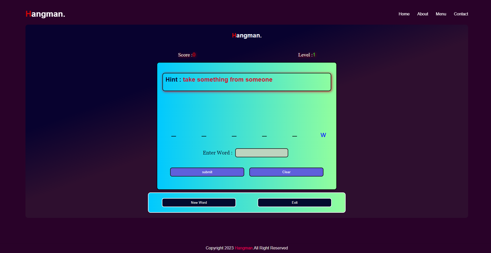
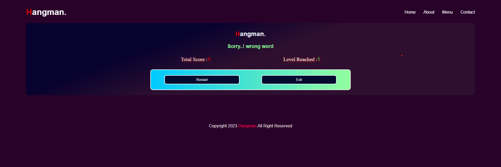

# Hangman Game Website

    

The Hangman Game Website is a simple and interactive web application built using the Django framework in Python. It provides an enjoyable gaming experience for users who want to challenge their vocabulary skills.

---

## Features

- **Word Selection:** The game randomly selects a word from a predefined list, ensuring a varied and engaging gameplay experience.
- **User Interface:** The website offers an intuitive and user-friendly interface, allowing players to interact with the game effortlessly.
- **Game Progress Tracking:** Players can see their progress as they guess the letters and track the number of attempts remaining.
- **Hint System:** A hint feature is available to provide players with clues when they get stuck, enhancing their chances of guessing the correct word.
- **Score Tracking:** The website keeps track of the user's score, recording the number of games won and lost.

---

## Installation

1. Clone the repository to your local machine using the following command:
      
       git clone https://github.com/Harish-Kushwah/GamingWebsiteUsingDjango.git
 
2. Install the necessary dependencies by running:
     
       pip install -r requirements.txt

3. Set up a virtual environment to isolate the project's dependencies.

4. Run database migrations with the following command:
      
        python manage.py migrate

5. Start the development server using:
        
        python manage.py runserver

---
## Screenshots

Here are some screenshots of the Hangman website

**Homepage**: "Welcome to our Hangman Game Website! Start playing and test your vocabulary skills."

**Gameplay**: "Guessing the word one letter at a time. Can you crack the code?"
**Hint Feature**: "Get a hint when you're stuck. Use it wisely to uncover a hidden letter!"

**Scoreboard**: "Track your progress"

---

## Contributing

Contributions to the Hangman Game Website are welcome! If you find any bugs or have suggestions for improvements, please open an issue or submit a pull request.

---
## License

This project is licensed under the MIT License. Feel free to use, modify, and distribute the code as per the terms of the license.

---
## Acknowledgements

This project was developed as a personal learning project by Harish Kushwah. Special thanks to the Django community for their excellent documentation and resources that aided in the development process.

Enjoy playing the Hangman Game Website and have fun challenging your vocabulary skills!

---
## Contact

If you have any questions, suggestions, or feedback regarding the Hangman Game Website, please feel free to reach out:

- Email: [harishkushwah54321@gmail.com](mailto:harishkushwah54321@gmail.com)
- GitHub Issues: [Project Issues](https://github.com/Harish-Kushwah/GamingWebsiteUsingDjango/issues)

You can also connect with me on [LinkedIn](https://www.linkedin.com/in/harish-kushwah) for further discussions and collaborations.

I appreciate your interest in the project and look forward to hearing from you!
